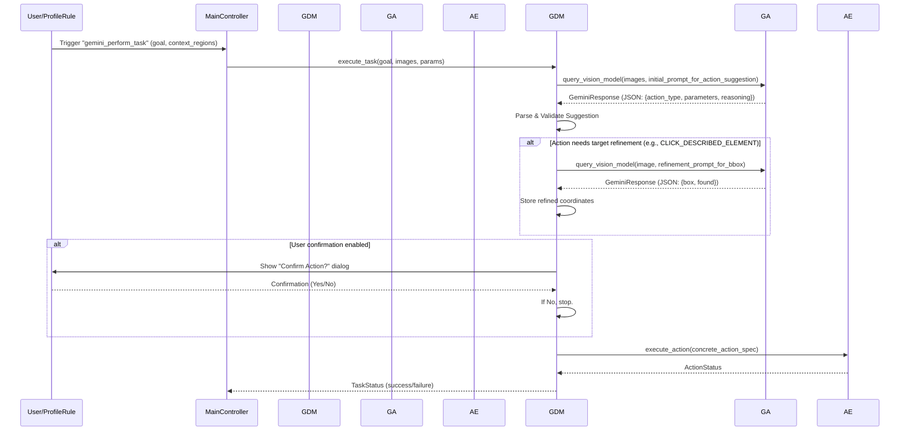

# Technical Design Document: Mark-I

This document outlines the technical design and architectural considerations for the Mark-I visual automation tool. It reflects decisions made in the Architectural Decision Records (ADRs) and current implementation status. As of the last update, v1.0.0, v2.0.0, v3.0.0, and v4.0.0 Phase 1/1.5 (Core Gemini Integration & Bounding Box Actions) are complete. Development for **v4.0.0 Phase 2 (Gemini-Informed Decision Making)** is now commencing with this design.

## 1. Core Architecture

The tool is modular, comprising several key Python components, all residing within the main `mark_i` package located at the project root:

- **`core.config_manager` Module:**
  - `load_environment_variables()` function: Called at application startup to load `.env` (containing `APP_ENV` and `GEMINI_API_KEY` for v4.0.0+) using `python-dotenv` (per ADR-007, ADR-008).
  - `ConfigManager` class: Responsible for loading, validating (basic structure), providing access to, and saving bot profiles (JSON files from the `profiles/` directory, per ADR-003). It also provides the base path for profile-related assets like templates.
  - Utilized by the `MainAppWindow` (GUI) for loading, saving, and path resolution for profiles and associated template images.
- **`core.logging_setup` Module:**
  - `setup_logging()` function: Called after environment variables are loaded. Initializes Python's `logging` system based on `APP_ENV`, configuring handlers (console, date-stamped rotating file), formatters, and log levels (per ADR-007). CLI flags can override console log level. The `APP_ROOT_LOGGER_NAME` is "mark_i".
- **`engines.capture_engine.CaptureEngine` Class:**
  - Responsible for capturing image data from specified screen regions using `Pillow.ImageGrab.grab(bbox=(x, y, x + width, y + height))` for Windows capture (per ADR-001).
  - Converts captured Pillow Image objects to OpenCV BGR NumPy arrays for consistent use by the `AnalysisEngine` and `GeminiAnalyzer`.
- **`engines.analysis_engine.AnalysisEngine` Class:**
  - Performs various **local** visual analyses on captured image regions (NumPy BGR arrays).
  - Provides methods for:
    - Pixel color analysis (`analyze_pixel_color`).
    - Average color calculation (`analyze_average_color`).
    - Template matching (`match_template`) using OpenCV (per ADR-001).
    - OCR text extraction (`ocr_extract_text`) using `pytesseract`, returning a dictionary with extracted `text` and an `average_confidence` score.
    - Dominant color analysis (`analyze_dominant_colors`) using k-means clustering.
- **`engines.gemini_analyzer.GeminiAnalyzer` Class (v4.0.0+):**
  - Responsibility: Handles all communication with the Google Gemini API for advanced visual understanding (per ADR-008).
  - Initialization: Takes API key (from `.env` via `os.getenv`) and optional default model name (from profile settings via `ConfigManager`).
  - Key Methods: Provides `query_vision_model(image_data, prompt, [model_name])` which sends image/prompt to the API and returns a structured response (including parsed text/JSON and status/error info).
  - Configuration: API key loaded from `.env`. Default model configurable via profile settings (`settings.gemini_default_model_name`).
  - Logging: Comprehensive logging of API interactions, errors, and latency.
  - _Details in Section 10._
- **`engines.rules_engine.RulesEngine` Class:**
  - Evaluates rules based on analysis results (from `AnalysisEngine` for local checks, or from `GeminiAnalyzer` for Gemini-powered `gemini_vision_query` conditions).
  - Supports single conditions, compound conditions (AND/OR logic per ADR-004), and rule-scoped variable capture and substitution.
  - Instantiates `GeminiAnalyzer` (for v4.0.0+), passing API key from `os.getenv` and default model from `ConfigManager`.
  - `gemini_vision_query` conditions are evaluated on-demand by `RulesEngine` during its evaluation cycle.
- **`engines.action_executor.ActionExecutor` Class:**
  - Simulates mouse and keyboard actions using `pyautogui` (per ADR-002).
  - Calculates target coordinates for actions, including those derived from Gemini bounding boxes (v4.0.0 Phase 1.5).
- **`engines.gemini_decision_module.GeminiDecisionModule` Class (NEW - v4.0.0 Phase 2):**
  - **Responsibility:** Enables Mark-I to use Gemini for more advanced decision-making. It takes a user-defined high-level goal and visual context, consults Gemini to suggest an action from a predefined set, validates the suggestion, and then instructs `ActionExecutor`.
  - _Details in Section 14._
- **`main_controller.MainController` Class:**
  - Orchestrates the main bot operation loop for runtime execution when using explicit rule-based profiles.
  - Runs the monitoring loop in a separate thread (per ADR-006).
  - For each monitored region in a profile:
    - Instructs `CaptureEngine` to capture the image.
    - Selectively instructs `AnalysisEngine` to perform required **local** general analyses based on `RulesEngine`'s pre-parsed dependencies.
  - Passes collected region data to `RulesEngine.evaluate_rules()`.
  - **(v4.0.0 Phase 2 Consideration):** May need modification or a new controller/mode to handle task-driven execution via `GeminiDecisionModule`. This module might operate within the existing loop (e.g., triggered by a special rule) or in a separate execution flow.
- **`ui.cli` Module:**
  - Provides the Command-Line Interface using `argparse` (per ADR-005).
  - Handles subcommands: `run <profile>`, `add-region <profile>`, and `edit [profile]`.
  - **(v4.0.0 Phase 2 Consideration):** May require a new CLI command or options to invoke task-driven mode using `GeminiDecisionModule`.
- **`ui.gui.region_selector.RegionSelectorWindow` Class:**
  - Provides GUI for visually selecting screen regions.
- **`ui.gui.main_app_window.MainAppWindow` Class:**
  - The main application window (`ctk.CTk`) for the full GUI profile editor.
  - **(v4.0.0 Phase 2 Consideration):** Will need enhancements to allow users to define "goals" or "tasks" for the `GeminiDecisionModule`, and potentially to configure its behavior (e.g., confirmation steps).
- **`ui.gui.panels.details_panel.DetailsPanel` Class:**
  - Encapsulates the logic for displaying and editing details of selected items (Regions, Templates, Rules).
  - Dynamically renders input widgets based on `gui_config.UI_PARAM_CONFIG`.
- **`mark_i/__main__.py`:**
  - Entry point for the application. Initializes core components (Env Vars, Logging, Config) and dispatches CLI commands.

## 2. Key Libraries & Justifications (Summary from ADRs)

-   **Environment Management:** `python-dotenv` (ADR-007)
-   **Logging:** Python `logging` module (ADR-007)
-   **Screen Capture:** `Pillow` (`ImageGrab` for Windows), `OpenCV-Python` (for conversion and potential alternatives) (ADR-001).
-   **Image Processing & Analysis (Local):** `OpenCV-Python` (cv2), `NumPy`, `Pillow` (ADR-001).
-   **OCR (Local):** `pytesseract` (ADR-001).
-   **Remote Advanced Visual Analysis & Decision Support (v4.0.0+):** `google-generativeai` (Python SDK for Gemini) (ADR-008).
-   **Input Simulation:** `pyautogui` (ADR-002).
-   **Configuration Storage:** `json` (Python built-in) (ADR-003).
-   **CLI Framework:** `argparse` (Python built-in) (ADR-005).
-   **GUI Framework:** `CustomTkinter` (and its dependency `Pillow` for `CTkImage`) (ADR-005).
-   **Concurrency (Bot Runtime):** Python `threading` module (ADR-006).

## 3. Defining and Capturing Regions

-   Regions are defined in the JSON profile with `name, x, y, width, height`.
-   The GUI (`MainAppWindow` using `RegionSelectorWindow`) allows users to define/edit these graphically.
-   `CaptureEngine.capture_region(region_spec)` uses `Pillow.ImageGrab.grab(bbox=(x, y, x + width, y + height))` on Windows. The result (Pillow Image) is converted to an OpenCV BGR NumPy array.
-   This captured BGR image is then available for local analysis by `AnalysisEngine`, remote analysis by `GeminiAnalyzer` (for `gemini_vision_query` conditions), and as visual context for `GeminiDecisionModule`.

## 4. "Reading" from the Region - Analysis Strategies

1.  **Local Selective Pre-emptive Analysis (by `MainController` via `AnalysisEngine`):**
    -   `RulesEngine.__init__` pre-parses rules, creating `_analysis_requirements_per_region` for **local** analysis types.
    -   `MainController` selectively calls `AnalysisEngine` methods based on these requirements.
2.  **Local On-Demand Analysis (by `RulesEngine` via `AnalysisEngine`):**
    -   Conditions like `pixel_color` and `template_match_found` are evaluated directly by `RulesEngine._evaluate_single_condition_logic` using the `captured_image`.
3.  **Remote On-Demand Analysis (by `RulesEngine` via `GeminiAnalyzer` - v4.0.0 Phase 1+):**
    -   `gemini_vision_query` conditions invoke `GeminiAnalyzer.query_vision_model()` on-demand.
4.  **Remote Contextual Analysis for Decision Making (NEW - by `GeminiDecisionModule` via `GeminiAnalyzer` - v4.0.0 Phase 2):**
    -   The `GeminiDecisionModule` will use `GeminiAnalyzer` to send images and goal-oriented prompts to Gemini, interpreting responses to suggest actions. This may involve one or more API calls per decision task.

## 5. Rules Engine & Evaluation (`RulesEngine`)

### 5.1. Rule Structure in JSON Profiles

-   **Condition Object:**
    -   Supports single local conditions, compound local conditions (AND/OR).
    -   Includes `gemini_vision_query` type (per ADR-008 Phase 1).
        -   Parameters: `type`, `region` (optional override), `prompt`, `expected_response_contains`, `case_sensitive_response_check`, `expected_response_json_path`, `expected_json_value`, `capture_as`, `model_name` (optional override).
-   **Action Object:**
    -   Types: `click`, `type_text`, `press_key`, `log_message`.
    -   `click` action supports `target_relation` including `center_of_gemini_element` and `top_left_of_gemini_element`, using `gemini_element_variable` parameter (v4.0.0 Phase 1.5).
-   **(v4.0.0 Phase 2 Consideration): New Rule Type for `GeminiDecisionModule` Invocation:**
    -   A new condition or action type might be needed to trigger the `GeminiDecisionModule`.
    -   Example "action" type:
        ```json
        {
          "type": "gemini_perform_task",
          "goal_prompt": "User-defined goal, e.g., 'Find the login button and click it.'",
          "context_region_names": ["main_screen_area", "maybe_a_specific_menu_area"], // Regions to provide as visual context
          "allowed_actions_override": ["CLICK_DESCRIBED_ELEMENT"], // Optional: further restrict allowed actions for this task
          "confirmation_required": true // Optional: override global setting
        }
        ```
    -   Alternatively, a new top-level "task" entry in the profile could define these goal-driven automations, separate from the explicit rule list. This needs further design decision in Phase 2.

### 5.2. `RulesEngine` Evaluation Logic

-   `_evaluate_single_condition_logic(...)` handles existing local and `gemini_vision_query` conditions.
-   `evaluate_rules(...)` iterates through rules, checks conditions, and if met, prepares and triggers actions via `ActionExecutor`.

### 5.3. Variable Handling (`RulesEngine`)

-   Rule-scoped variables captured via `capture_as` in conditions.
-   Supports `{"value": <actual_data>, "_source_region_for_capture_": "region_name"}` structure for Gemini captures, crucial for interpreting relative bounding boxes.
-   `_substitute_variables` method handles placeholder substitution in action parameters using dot notation.

## 6. Data Flow Example (Continuous Loop - Rule-Based)

(Data flow for rule-based operation as described in previous `TECHNICAL_DESIGN.MD` version, including Gemini Bounding Box click, remains valid for that mode of operation.)

**(v4.0.0 Phase 2 Consideration): A new data flow will be needed for task-driven execution via `GeminiDecisionModule`. This will be detailed in Section 14.3.**

## 7. Logging System (per ADR-007)

-   Uses Python's built-in `logging`, configured by `core.logging_setup`. Root logger: `mark_i`.
-   **v4.0.0+ Specifics:**
    -   `GeminiAnalyzer` logs API requests, responses, errors, latency.
    -   `RulesEngine` logs `gemini_vision_query` invocations and outcomes.
    -   `ActionExecutor` logs details for Gemini-element-targeted actions.
    -   **(NEW - v4.0.0 Phase 2): `GeminiDecisionModule` will log user goals, prompts to Gemini for decision-making, Gemini's suggested actions, validation steps, any refinement queries, and final executed actions or failures.**

## 8. Error Handling

-   Extensive `try-except` blocks. User-facing errors via `messagebox` or `stderr`. Detailed exceptions logged.
-   **v4.0.0+ Specifics:**
    -   `GeminiAnalyzer` robustly handles API errors.
    -   `RulesEngine` gracefully handles `GeminiAnalyzer` failures for `gemini_vision_query`.
    -   `ActionExecutor` handles malformed/missing bounding box data for Gemini element clicks.
    -   **(NEW - v4.0.0 Phase 2): `GeminiDecisionModule` must robustly handle invalid or unsafe suggestions from Gemini, API errors during its consultations, and failures in refining targets or executing actions. It should provide clear error states/messages.**

## 9. Full GUI Architecture (`MainAppWindow` using `CustomTkinter`)

(Existing GUI architecture for profile settings, regions, templates, and rule editing (including `gemini_vision_query` conditions and Phase 1.5 bounding box actions) remains as previously defined.)

### 9.x. (NEW - v4.0.0 Phase 2 Consideration): GUI Enhancements for `GeminiDecisionModule`

-   **Task/Goal Definition:**
    *   A new section in the GUI might be needed to define "Gemini Tasks" if they are stored separately from rules.
    *   If invoked via a rule, the `DetailsPanel` will need to render parameters for the `gemini_perform_task` action/condition type (e.g., `CTkTextbox` for `goal_prompt`, a multi-selection mechanism for `context_region_names`).
-   **Runtime Feedback:** If Mark-I is operating in a task-driven mode, the GUI might need to display the current goal, Gemini's suggested step, and status.
-   **Configuration:** Settings for `GeminiDecisionModule` (e.g., global "confirm Gemini actions" flag).

## 10. Gemini API Interaction (`GeminiAnalyzer` - v4.0.0 Phase 1+)

(Structure and methods as previously defined: `__init__`, `query_vision_model`. Handles image prep, API calls, response parsing (text/JSON), error handling, and logging for direct vision queries.)

### 10.3. Prompting for Bounding Boxes (v4.0.0 Phase 1.5)

(Strategy for prompting Gemini to return JSON with `box: [x,y,w,h]` and `found: true/false` as previously defined, used by `RulesEngine` for `gemini_vision_query` and `ActionExecutor`.)

## 11. GUI Configuration for Gemini (v4.0.0 Phase 1 & 1.5)

(`gui_config.py` and `DetailsPanel` support for `gemini_vision_query` condition parameters and action parameters for Gemini element targeting, including conditional visibility, as previously defined.)

## 12. `ActionExecutor` - Handling Gemini Element Clicks (v4.0.0 Phase 1.5)

(`_get_target_coords` method extended to parse wrapped Gemini bounding box data and calculate absolute click coordinates, as previously defined.)

## 13. Testing Strategy

(Existing testing strategies for Phase 1 and 1.5 remain relevant.)

### 13.x. (NEW - v4.0.0 Phase 2): Testing `GeminiDecisionModule`

-   **Unit Tests:**
    *   Mock `GeminiAnalyzer` to simulate various Gemini responses (valid action suggestions, invalid suggestions, errors, requests for clarification).
    *   Verify `GeminiDecisionModule` correctly parses responses, validates actions against the predefined set, and forms correct specifications for `ActionExecutor`.
    *   Test parameter validation logic.
    *   Test target refinement logic (mocking the secondary call to `GeminiAnalyzer` for bounding boxes).
-   **Integration Tests:**
    *   Manual testing with real Gemini API calls.
    *   Define various user goals and provide different screen contexts.
    *   Observe Mark-I's behavior: Does it correctly interpret the goal? Does Gemini suggest a sensible action? Is the action executed correctly and safely?
    *   Test scenarios where Gemini might be ambiguous or suggest unsafe actions to ensure safety overrides work.
    *   Test different `context_region_names` configurations.
-   **Focus Areas:** Prompt effectiveness, reliability of Gemini's suggestions, robustness of validation logic, safety mechanisms.

---
## 14. Gemini Decision Module (`GeminiDecisionModule` - v4.0.0 Phase 2)

This section details the architecture and operation of the `GeminiDecisionModule`, which enables Mark-I to use Google Gemini for more advanced decision-making based on user goals and visual context.

### 14.1. Overview and Purpose

*   **Goal:** To allow users to specify higher-level tasks or goals (e.g., "Click the 'Next' button," "Respond to the latest email with 'Got it'"), and have Mark-I, with Gemini's assistance, determine and execute appropriate simple actions from a predefined, limited set. This module aims to bridge the gap between specific visual conditions and broader user intent.
*   **Differentiation from `RulesEngine`:**
    *   **`RulesEngine`:** Executes user-defined, explicit "IF `condition` THEN `action`" logic. It is deterministic based on the configured rules. `gemini_vision_query` conditions within the `RulesEngine` ask specific questions about the visual scene to feed into this explicit logic.
    *   **`GeminiDecisionModule`:** Takes a user's *goal*. It uses Gemini to interpret the visual scene *in the context of that goal* and then *suggests an action* to help achieve it. This introduces a layer of AI-driven reasoning for action selection, rather than just visual state evaluation.
*   **Core Principle:** Enhance automation capabilities for scenarios where defining exhaustive explicit rules is difficult, too brittle, or where a degree of intelligent interpretation of the scene relative to a goal is desired. It operates within controlled boundaries defined by a limited set of allowed actions.

### 14.2. Module Architecture and Components

*   **`mark_i.engines.gemini_decision_module.GeminiDecisionModule` Class:**
    *   **Responsibilities:**
        1.  Receive a user goal (string) and visual context (images of relevant screen regions).
        2.  Interact with `GeminiAnalyzer` to consult the Gemini API, providing the goal and visual data to request an action suggestion.
        3.  Parse the structured response (expected JSON) from Gemini, which should contain a suggested action type and necessary parameters.
        4.  Validate the suggested action against a predefined list of allowed actions and ensure its parameters are sensible and safe.
        5.  If the suggested action involves targeting a vaguely described element (e.g., "the blue button"), use `GeminiAnalyzer` again (similar to `gemini_vision_query`) to obtain precise bounding box coordinates for that element.
        6.  Construct a full action specification and instruct `ActionExecutor` to perform the validated and refined action.
        7.  (Future iterations of Phase 2) Potentially manage state for simple multi-step tasks if a single action isn't sufficient and Gemini suggests a sequence.
        8.  Provide status feedback (success, failure, reason) for the decision-making and execution process.
    *   **Key Dependencies:** `GeminiAnalyzer` (for all communication with Gemini), `ActionExecutor` (to perform the final chosen action), `ConfigManager` (for access to profile settings or region definitions if needed for context).
*   **User Goal Input Mechanism:**
    *   **Initial Implementation (via a new "Task" rule type or action type):** A new way to define a "task" within the existing profile JSON structure.
        *   Example "action" type in a rule:
          ```json
          {
            "name": "PerformLoginTask",
            "condition": { "type": "always_true" }, // Or a more specific trigger
            "action": {
              "type": "gemini_perform_task",
              "goal_prompt": "Log into the application using username 'testuser' and password 'password123'. Find the username field, then the password field, then the login button.",
              "context_region_names": ["login_form_area"], // Region(s) containing the relevant UI
              "allowed_actions_override": ["CLICK_DESCRIBED_ELEMENT", "TYPE_IN_DESCRIBED_FIELD"], // Optional
              "max_steps": 3, // Optional: limit for simple sequences
              "require_confirmation_before_each_step": false // Optional
            }
          }
          ```
    *   **Future GUI:** A dedicated UI section for defining and triggering these Gemini-driven tasks, perhaps with more structured input for goals and parameters.
*   **Predefined Allowed Actions (`ALLOWED_GEMINI_ACTIONS`):**
    *   A hardcoded constant or enum within `GeminiDecisionModule` defining the simple actions Gemini is permitted to suggest. This is a critical safety boundary.
    *   Examples:
        *   `CLICK_DESCRIBED_ELEMENT`: Requires `target_description` (string).
        *   `TYPE_IN_DESCRIBED_FIELD`: Requires `text_to_type` (string) and `target_description` (string for field).
        *   `PRESS_KEY_SIMPLE`: Requires `key_name` (string, e.g., "enter", "tab").
        *   `WAIT_SHORT`: Requires `duration_seconds` (float, e.g., 1.0).
        *   (Potentially) `CHECK_ELEMENT_PROPERTY`: Requires `target_description` and `property_to_check` (e.g., "is_enabled", "text_content_is"), returning a boolean for internal decision loops.
    *   Each allowed action will map to a more detailed action specification that `ActionExecutor` can understand, possibly after refinement (e.g., `target_description` becomes specific coordinates).

### 14.3. Data Flow and Interaction Diagram

1.  **Invocation:**
    *   `MainController`'s loop encounters a rule with the `gemini_perform_task` action.
    *   `MainController` gathers current images for specified `context_region_names`.
    *   `MainController` calls `GeminiDecisionModule.execute_task(goal_prompt, context_images, task_parameters)`.
2.  **`GeminiDecisionModule.execute_task()`:**
    *   **Step 1: Initial Action Suggestion.**
        *   Constructs a detailed prompt for `GeminiAnalyzer` including:
            *   System role (e.g., "You are a helpful assistant. Suggest the best single action from the allowed list to progress towards the user's goal.").
            *   The `user_goal_prompt`.
            *   The list of `PREDEFINED_ALLOWED_ACTIONS` and their expected parameters.
            *   Instructions for Gemini to respond with a JSON object: `{"action_type": "ACTION_NAME", "parameters": {"param1": "value1", ...}, "reasoning": "..."}`.
        *   Sends this prompt and `context_images` via `GeminiAnalyzer.query_vision_model()`.
    *   **Step 2: Parse and Validate Suggestion.**
        *   Receives response (hopefully JSON) from `GeminiAnalyzer`.
        *   If API error or blocked content, log and return failure.
        *   Parse JSON. Validate `action_type` against `PREDEFINED_ALLOWED_ACTIONS`.
        *   Validate presence and basic types of expected `parameters` for the chosen `action_type`. If invalid, log and return failure or attempt clarification (future).
    *   **Step 3: Target Refinement (If Action Requires It).**
        *   If `action_type` is `CLICK_DESCRIBED_ELEMENT` or `TYPE_IN_DESCRIBED_FIELD`, the `parameters` will contain a `target_description` (e.g., "the submit button," "the username text field").
        *   `GeminiDecisionModule` constructs a *new, focused prompt* for `GeminiAnalyzer` using the relevant `context_image` and the `target_description`:
            `"Visually locate the element described as '${target_description}'. Respond ONLY with JSON: {\"element_label\":\"${target_description}\", \"box\":[x,y,w,h], \"found\":true/false}"`
        *   Sends this refinement query via `GeminiAnalyzer.query_vision_model()`.
        *   If `found` is true and `box` is valid, these coordinates (relative to the context image) are stored. If not found, the task step may fail or Gemini might be re-prompted.
    *   **Step 4: Construct `ActionExecutor` Specification.**
        *   Translate the validated (and refined) Gemini suggestion into a concrete action spec that `ActionExecutor` understands.
            *   For `CLICK_DESCRIBED_ELEMENT`: Use the refined bounding `box` and the `_source_region_for_capture_` (from the refinement query's context image) to set up a click action similar to Phase 1.5 (e.g., `target_relation: center_of_gemini_element`, `gemini_element_variable` would effectively point to this internally resolved box data).
            *   For `TYPE_IN_DESCRIBED_FIELD`: First click the field (using refined box), then type.
    *   **(Optional) Step 5: User Confirmation.**
        *   If `require_confirmation_before_each_step` is true, show a dialog: "Gemini proposes to: [describe action and target]. Proceed?"
    *   **Step 6: Execute Action.**
        *   Call `self.action_executor.execute_action(final_action_spec, context_for_action_executor)`.
    *   **(Future) Step 7: Loop for Multi-Step Tasks.**
        *   If `max_steps > 1` and Gemini suggests a sequence or indicates more steps are needed, the module could loop, re-capturing visual context and re-invoking Gemini with updated state/prompt. This is a more advanced feature for later iterations of Phase 2.
    *   **Step 8: Return Status.**

**Diagram: GeminiDecisionModule High-Level Sequence**



### 14.4. Prompt Engineering Strategies

*   **System Role Prompting:** Clearly define Mark-I's role and Gemini's task: "You are an AI assistant controlling a desktop automation tool. Your goal is to achieve the user's stated task by selecting the most appropriate *single action* from the following allowed list: `[...]`. You MUST respond with a JSON object formatted as `{\"action_type\": \"CHOSEN_ACTION_TYPE\", \"parameters\": {\"param_name\": \"value\"}, \"reasoning\": \"Your brief reasoning\"}`. Only use actions from the provided list."
*   **Action List and Parameterization:** Provide the exact list of `PREDEFINED_ALLOWED_ACTIONS` and what parameters each expects (e.g., "`CLICK_DESCRIBED_ELEMENT` requires `target_description`; `TYPE_IN_DESCRIBED_FIELD` requires `text_to_type` and `target_description`)."
*   **User Goal Presentation:** Clearly embed the `user_goal_prompt` within Gemini's prompt.
*   **Visual Context Handling:** Pass images clearly. For multiple regions, consider sending them distinctly or as a composite if the model handles it well. The prompt should guide Gemini on how to interpret multiple images if necessary (e.g., "Image 1 is 'main_screen', Image 2 is 'dialog_box'").
*   **Few-Shot Examples (Crucial):** Include 2-3 examples in the prompt demonstrating the user goal, visual context (even if just described textually in the prompt if images are separate), and the *exact desired JSON output* from Gemini. This heavily guides the model to produce the correct format.
    *   Example: `User goal: "Click the login button." Image description: "A login form with a blue button labeled 'Login'." Expected JSON output: {"action_type": "CLICK_DESCRIBED_ELEMENT", "parameters": {"target_description": "the blue button labeled 'Login'"}, "reasoning": "User wants to log in, this is the login button."}`
*   **Refinement Prompts for Bounding Boxes:** These will be similar to those in Phase 1.5: concise, asking for JSON with `box` and `found` keys for a *specific described element*.
*   **Iterative Refinement:** Prompt engineering will be an iterative process. Start simple, test, and refine prompts based on Gemini's actual responses.

### 14.5. Safety, Control, and Limitations (Phase 2 Initial)

*   **Restricted Action Space:** Gemini can *only* choose from `PREDEFINED_ALLOWED_ACTIONS`. Any other suggestion is an error.
*   **Parameter Validation & Sanitization:**
    *   `GeminiDecisionModule` validates that Gemini provides the *expected parameters* for the chosen action type.
    *   Values for parameters (e.g., `text_to_type`, `key_name`) must be checked. E.g., disallow overly long text, ensure `key_name` is a known valid key for PyAutoGUI.
*   **No Arbitrary Code/Command Execution:** Gemini cannot make Mark-I run arbitrary scripts or shell commands.
*   **Limited Scope (Initial Phase 2):**
    *   Focus on single-step or very simple, explicitly linked two-step actions (e.g., click field then type).
    *   Complex multi-step planning or long-term memory is out of scope initially.
*   **User Confirmation:** A profile-level or task-level setting `require_confirmation_before_each_step` (defaulting to `True` initially for safety) should be implemented. If true, Mark-I will show a dialog to the user with Gemini's proposed action before executing it.
*   **Clear Logging:** All stages of the decision process, including Gemini's raw suggestion (if parseable), reasoning, validation results, and any executed action, must be logged at appropriate levels.
*   **Error Handling:**
    *   If Gemini's response is not valid JSON or doesn't conform to the expected action structure, the task fails with a clear log message.
    *   If a refinement query for a bounding box fails (element not found by Gemini), the step fails.
    *   If `ActionExecutor` fails, the error is propagated.

### 14.6. GUI Integration Considerations

*   **Task Definition in Profile:**
    *   The `MainAppWindow` and `DetailsPanel` will need to be extended to support adding/editing the new `gemini_perform_task` action type (or a new "Tasks" list if separated from rules).
    *   This includes UI elements for:
        *   `goal_prompt` (likely `CTkTextbox`).
        *   `context_region_names` (multi-select list of defined regions).
        *   `allowed_actions_override` (multi-select checklist of `PREDEFINED_ALLOWED_ACTIONS`).
        *   `max_steps` (entry).
        *   `require_confirmation_before_each_step` (checkbox).
*   **Runtime UI (Future - Low Priority for Initial Phase 2):**
    *   A non-intrusive overlay or status bar message could indicate: "Mark-I is thinking (via Gemini)..." or "Gemini proposes: [action]. Confirm?".
*   **Configuration:** Global setting in profile for `require_confirmation_before_each_step` default.

### 14.7. Relationship to `RulesEngine` and Other Components

*   **Invocation:** The `GeminiDecisionModule` will likely be invoked as an "action" from within a standard rule processed by the `RulesEngine`. This allows users to use existing condition types to decide *when* to delegate a task to Gemini.
    ```json
    // Example rule:
    {
        "name": "IfUserWindowActive_ThenAIDoLogin",
        "region": "main_app_window_region",
        "condition": { 
            "type": "template_match_found", // e.g., check if the app window is active
            "template_filename": "app_login_screen_indicator.png"
        },
        "action": {
            "type": "gemini_perform_task", // This new action type invokes GeminiDecisionModule
            "goal_prompt": "Complete the login process on this screen.",
            "context_region_names": ["main_app_window_region", "login_button_area"],
            // other task parameters...
        }
    }
    ```
*   **Shared `GeminiAnalyzer`:** Both `RulesEngine` (for `gemini_vision_query`) and `GeminiDecisionModule` will use the same `GeminiAnalyzer` instance for API communication, ensuring consistent API key and default model usage.
*   **Shared `ActionExecutor`:** The `GeminiDecisionModule` will ultimately use the existing `ActionExecutor` to perform the actions it decides upon, ensuring consistency in how actions are physically carried out.
