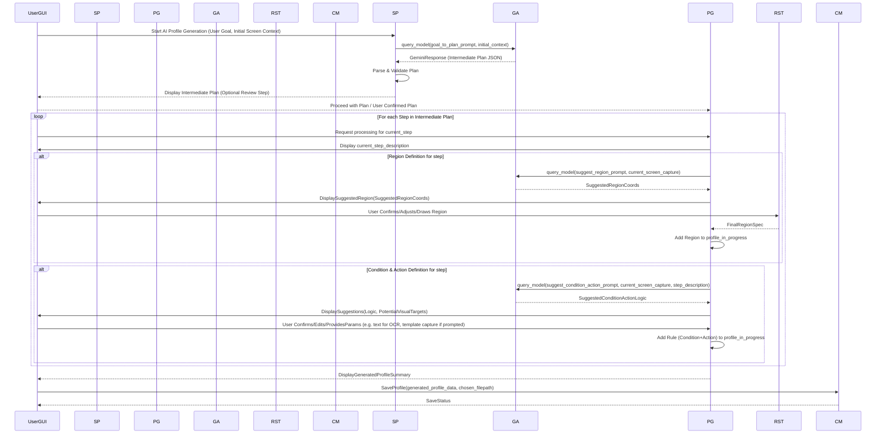

# Technical Design Document: Mark-I

This document outlines the technical design and architectural considerations for the Mark-I visual automation tool. It reflects decisions made in the Architectural Decision Records (ADRs) and current implementation status.
Version 4.0.0 (Gemini-Powered Visual Intelligence), including all its sub-phases, is functionally complete.
**This document now incorporates the design for v5.0.0, focusing on AI-Driven Profile Generation as per ADR-009.**

## 1. Core Architecture

The tool is modular, comprising several key Python components, all residing within the main `mark_i` package:

- **`core.config_manager` Module:**
  - `load_environment_variables()`: Loads `.env` (for `APP_ENV`, `GEMINI_API_KEY`).
  - `ConfigManager` class: Manages loading, validation, access, and saving of JSON bot profiles. Handles path resolution for profiles and templates.
- **`core.logging_setup` Module:**
  - `setup_logging()`: Initializes Python's `logging` system based on `APP_ENV` and CLI flags. Root logger: `mark_i`.
- **`engines.capture_engine.CaptureEngine` Class:**
  - Captures screen regions (uses `Pillow.ImageGrab` on Windows). Converts to OpenCV BGR NumPy arrays.
- **`engines.analysis_engine.AnalysisEngine` Class:**
  - Performs local visual analyses (pixel color, average color, template matching, OCR, dominant colors) on BGR NumPy arrays.
- **`engines.gemini_analyzer.GeminiAnalyzer` Class (v4.0.0+):**
  - Handles all direct communication with Google Gemini APIs (both vision and text models as needed).
  - Manages API key, request formation (image/text prompts), response parsing (text/JSON), error handling, and detailed logging of API interactions.
  - Used by `RulesEngine` (for `gemini_vision_query`), `GeminiDecisionModule` (for NLU and step-specific visual queries), and **`StrategyPlanner` (for v5.0.0 AI Profile Generation)**.
  - _Details in Section 10._
- **`engines.rules_engine.RulesEngine` Class:**
  - Evaluates rules based on analysis results.
  - Supports single/compound conditions, variable capture/substitution.
  - Handles `gemini_vision_query` conditions by invoking `GeminiAnalyzer`.
  - For actions of type `gemini_perform_task`, it invokes the `GeminiDecisionModule` to handle NLU commands and goal-oriented task execution.
  - _Details in Section 5._
- **`engines.action_executor.ActionExecutor` Class:**
  - Simulates mouse and keyboard actions using `pyautogui`.
  - Calculates target coordinates, including for Gemini-identified bounding boxes.
  - Called by `RulesEngine` for standard actions and by `GeminiDecisionModule` for executing primitive steps of an NLU-driven task.
- **`engines.gemini_decision_module.GeminiDecisionModule` Class (v4.0.0 Phase 2 & 3):**
  - NLU Task Orchestrator: Parses natural language user commands.
  - Decomposes commands into a sequence of manageable steps/sub-goals using Gemini for NLU.
  - For each decomposed step, uses `GeminiAnalyzer` for visual analysis and action refinement.
  - Manages basic state across steps of a single NLU task.
  - Orchestrates execution of these steps by calling `ActionExecutor`.
  - _Details extensively in Section 14._
- **`generation.strategy_planner.StrategyPlanner` Module (NEW - v5.0.0):**
  - Takes a high-level user goal for automation.
  - Uses `GeminiAnalyzer` to interact with Gemini to break this goal down into an "intermediate plan" (a sequence of logical, human-understandable sub-steps or sub-goals).
  - _Details in Section 15._
- **`generation.profile_generator.ProfileGenerator` Module (NEW - v5.0.0):**
  - Takes the "intermediate plan" from the `StrategyPlanner`.
  - Iterates through plan steps, interacting with the user (via GUI) and `GeminiAnalyzer` (for visual suggestions) to define concrete Mark-I profile elements (regions, conditions, actions, templates).
  - Assembles these elements into a Mark-I JSON profile structure.
  - _Details in Section 15._
- **`main_controller.MainController` Class:**
  - Orchestrates the main bot loop for rule-based profile execution.
  - Instantiates core engine components.
  - **(v5.0.0 Consideration):** A new controller or mode might be needed to manage the AI Profile Generation workflow, distinct from the runtime bot loop.
- **`ui.cli` Module:**
  - Provides CLI using `argparse`.
  - **(v5.0.0 Consideration):** May require a new CLI command (e.g., `mark_i generate-profile --goal "my goal"`) to trigger AI profile generation.
- **`ui.gui.*` Modules:**
  - `MainAppWindow`, `DetailsPanel`, etc., provide the GUI editor.
  - **(v5.0.0 Consideration):** Significant new GUI components will be needed for the AI Profile Generation workflow (goal input, plan review, interactive element definition guided by AI).
  - _Details in Section 9 and 11 (for existing features) and Section 15.4 (for new GUI)._
- **`mark_i/__main__.py`:** Application entry point.

## 2. Key Libraries & Justifications (Summary from ADRs)
*(No changes to core library stack from v4.0.0)*
-   **Environment Management:** `python-dotenv`
-   **Logging:** Python `logging` module
-   **Screen Capture:** `Pillow` (`ImageGrab`), `OpenCV-Python`
-   **Image Processing & Analysis (Local):** `OpenCV-Python`, `NumPy`, `Pillow`
-   **OCR (Local):** `pytesseract`
-   **Remote Advanced Visual Analysis, NLU, Decision Support, Plan Generation (v4.0.0+):** `google-generativeai`
-   **Input Simulation:** `pyautogui`
-   **Configuration Storage:** `json`
-   **CLI Framework:** `argparse`
-   **GUI Framework:** `CustomTkinter`
-   **Concurrency (Bot Runtime):** Python `threading` module

## 3. Defining and Capturing Regions
*(No fundamental changes. For v5.0.0 AI Profile Generation, region *suggestion* by AI and confirmation/drawing by user will be a new interaction, but the underlying region definition structure remains.)*

## 4. "Reading" from the Region - Analysis Strategies
*(Existing strategies remain. For v5.0.0 AI Profile Generation, `GeminiAnalyzer` will be heavily used by `StrategyPlanner` and `ProfileGenerator` to understand context and suggest elements for the profile.)*

## 5. Rules Engine & Evaluation (`RulesEngine`)

### 5.1. Rule Structure in JSON Profiles
*(Existing structure for conditions and actions remains. The AI Profile Generator (v5.0.0) will *output* profiles adhering to this established structure.)*

-   **Condition Object:** Single local, compound local, `gemini_vision_query`.
-   **Action Object:** `click` (with Gemini bounding box support), `type_text`, `press_key`, `log_message`, `gemini_perform_task` (for NLU runtime execution).

### 5.2. `RulesEngine` Evaluation Logic
*(No fundamental changes for v5.0.0. The RulesEngine executes profiles; the AI Profile Generator creates them.)*

### 5.3. Variable Handling (`RulesEngine`)
*(No fundamental changes for v5.0.0.)*

## 6. Data Flow Example for NLU Task (`gemini_perform_task` - v4.0.0 Phase 3)
*(This existing data flow remains valid for *runtime execution* of NLU tasks. Section 15.3 will detail the new data flow for *AI-driven profile generation*.)*

## 7. Logging System (per ADR-007)
- Root logger: `mark_i`.
- **(v5.0.0 Enhancement):** Logging for `StrategyPlanner` and `ProfileGenerator` will be critical:
    *   User's input goal.
    *   Prompts to Gemini for plan generation.
    *   Gemini's raw and parsed intermediate plan.
    *   For each plan step: prompts for element/region suggestions, AI's suggestions, user's confirmations/modifications.
    *   Details of the generated profile elements.
    *   Errors or ambiguities encountered during the generation process.

## 8. Error Handling
- **(v5.0.0 Enhancement):**
    *   **`StrategyPlanner`:** Must handle Gemini failures in generating a coherent plan (e.g., API errors, unusable output). Fallback: notify user, suggest rephrasing goal.
    *   **`ProfileGenerator`:** Must handle failures in suggesting specific profile elements (e.g., Gemini can't identify a relevant region for a step, or a user rejects all suggestions). Allow user to skip a step, manually define the element, or abandon generation.
    *   Ensure generated profiles are structurally valid JSON.

## 9. Full GUI Architecture (`MainAppWindow` using `CustomTkinter`)
*(Existing GUI architecture for profile editing remains.)*

### 9.x. (NEW - v5.0.0): GUI for AI-Driven Profile Generation
-   **Invocation:** A new menu item (e.g., "File > New AI-Generated Profile...") or a button in `MainAppWindow`.
-   **Workflow Stages:**
    1.  **Goal Input:** A dialog or dedicated panel with a `CTkTextbox` for the user to type their high-level automation goal. Option to provide an initial full screenshot or select an application window for context.
    2.  **Plan Review & Confirmation (Optional but Recommended):** Display the intermediate plan (sequence of steps) generated by `StrategyPlanner` (from Gemini). Allow user to review, possibly reorder or remove steps, or ask for regeneration.
    3.  **Interactive Element Definition:** For each step in the (confirmed) plan:
        *   **Region Focus:** The GUI might highlight a suggested screen area (based on AI suggestion) or ask the user to draw/confirm a region relevant to the current step (using a `RegionSelector`-like overlay).
        *   **Condition/Action Suggestion:** Display AI's suggestion for how to implement the step (e.g., "Condition: OCR text 'Username:' is present. Action: Click nearby field.").
        *   **Element Grounding:** If AI suggests interacting with "the username field," it might overlay bounding box suggestions on the screen capture. User clicks to confirm the correct one.
        *   **Template Capture Prompt:** If AI suggests a template is needed (e.g., "Look for this icon: [description]"), prompt the user to capture that template image from the screen.
        *   **Parameter Input:** Prompt for any parameters AI cannot infer (e.g., "What username should I type?").
    4.  **Profile Summary & Save:** Once all steps are processed, show a summary of the generated profile structure (regions, rules). Allow user to save it as a new `.json` file, which can then be opened in the standard editor for further refinement.
-   This interactive GUI will be a major new component, likely managed by a new top-level window or a dedicated mode within `MainAppWindow`.

## 10. Gemini API Interaction (`GeminiAnalyzer` - v4.0.0+)
*(No fundamental changes to `GeminiAnalyzer` itself. For v5.0.0, it will be used by `StrategyPlanner` for goal-to-plan generation (likely text/multimodal prompts) and by `ProfileGenerator` for suggesting visual elements/regions for specific plan steps (likely vision prompts).)*

### 10.3. Prompting for Bounding Boxes (v4.0.0 Phase 1.5+)
*(This existing capability will be crucial for the `ProfileGenerator` in v5.0.0 to help ground AI's textual descriptions of UI elements to actual screen locations for the generated profile.)*

## 11. GUI Configuration for Gemini (v4.0.0+)
*(Existing GUI config for `gemini_vision_query` and `gemini_perform_task` remains. For v5.0.0, new UI elements for the AI Profile Generation workflow will not be part of `UI_PARAM_CONFIG` but rather a new GUI view/dialog system.)*

## 12. `ActionExecutor`
*(No fundamental changes. It will execute actions defined in the AI-generated profiles just like any other profile.)*

## 13. Testing Strategy
### 13.x. (NEW - v5.0.0): Testing AI-Driven Profile Generation
-   **Goal-to-Plan Generation:**
    *   Test with diverse high-level goals.
    *   Mock `GeminiAnalyzer` to simulate various plan structures (correct, incomplete, illogical) from Gemini.
    *   Verify `StrategyPlanner` correctly parses plans and handles errors.
-   **Plan-to-Profile Element Generation:**
    *   For each type of plan step, test the `ProfileGenerator`'s ability to:
        *   Suggest relevant regions (mock visual context).
        *   Suggest appropriate condition/action types.
        *   Guide user through template capture or parameter input.
        *   Correctly assemble the JSON for that rule/element.
-   **End-to-End Profile Generation:**
    *   Manual testing with real Gemini API.
    *   Provide a goal, go through the interactive GUI workflow.
    *   Evaluate the quality, correctness, and efficiency of the generated Mark-I profile.
    *   Test if the generated profile actually works when run by Mark-I's execution engine.
-   **Usability:** Test the intuitiveness and helpfulness of the AI-assisted profile creation GUI.

---
## 14. Gemini Decision Module & NLU Task Orchestration (v4.0.0 Phase 2 & 3 - Final)

*(This entire section, as detailed in the previous response where Phase 3 was completed, remains valid. It describes the runtime NLU capabilities of Mark-I v4.0.0. For v5.0.0, this module's visual refinement capabilities might be leveraged by the `ProfileGenerator`.)*

### 14.1. Overview and Purpose (Final v4.0.0)
*   **Goal:** Enables users to issue high-level commands via the `gemini_perform_task` action's `natural_language_command` parameter. The `GeminiDecisionModule` parses these, decomposes them, and orchestrates execution. Each sub-step uses Gemini for precise visual targeting and action selection from `PREDEFINED_ALLOWED_SUB_ACTIONS`.
*   **Operation:** Acts as an intermediary between an NLU instruction and a sequence of UI interactions.

### 14.2. Module Architecture and Components (Final v4.0.0)
*   **`mark_i.engines.gemini_decision_module.GeminiDecisionModule` Class:**
    *   **Responsibilities:** NLU & Command Parsing, Task Decomposition & Planning, Step Execution Orchestration (calling `_execute_primitive_sub_action`), State Management (basic), Error Handling.
*   **`PREDEFINED_ALLOWED_SUB_ACTIONS` Constant:** Defines primitive actions (e.g., `CLICK_DESCRIBED_ELEMENT`, `TYPE_IN_DESCRIBED_FIELD`, `PRESS_KEY_SIMPLE`, `CHECK_VISUAL_STATE`).
*   **Internal Task Plan:** List of step objects from NLU.

### 14.3. Data Flow and Interaction for NLU Task (Final v4.0.0)
*   `Rule Trigger` -> `RulesEngine` (`gemini_perform_task`) -> `GeminiDecisionModule.execute_nlu_task()` -> `GDM` uses `GA` for NLU -> `GDM` gets plan -> Loop steps: `GDM` uses `GA` for sub-step action/refinement -> `GDM` (optional confirm) -> `GDM` calls `AE`.

### 14.4. Prompt Engineering Strategies (Final v4.0.0)
#### 14.4.1. Prompts for NLU & Task Decomposition (`_construct_nlu_parse_prompt`)
*   System role, user command, detailed JSON output schema instructions, few-shot examples.
#### 14.4.2. Prompts for Per-Step Visual Target Refinement (`_refine_target_description_to_bbox`)
*   Role ("precise visual element locator"), target description, JSON output instructions for `box` and `found`.

### 14.5. Safety, Control, and Limitations (Final v4.0.0)
*   Adherence to `PREDEFINED_ALLOWED_SUB_ACTIONS`.
*   Validation of NLU outputs.
*   `max_steps` and `require_confirmation_per_step` parameters.
*   NLU accuracy dependent on Gemini and prompt quality. Basic error handling.

### 14.6. GUI Integration (Final v4.0.0)
*   `gemini_perform_task` action in `DetailsPanel` configured via `gui_config.py` (parameters: `natural_language_command`, `context_region_names`, `allowed_actions_override`, `require_confirmation_per_step`, `max_steps`).

### 14.7. Invocation from `RulesEngine` (Final v4.0.0)
*   `RulesEngine` calls `GeminiDecisionModule.execute_nlu_task()` when `gemini_perform_task` action is triggered.

---
## 15. AI-Driven Profile Generation (`StrategyPlanner` & `ProfileGenerator` - v5.0.0)

This new system, introduced in v5.0.0 as per ADR-009, aims to assist users in creating Mark-I profiles from high-level goals. It involves AI for strategic planning and AI-assistance for defining profile elements interactively.

### 15.1. Overview and Purpose (v5.0.0)

*   **Goal:** To significantly reduce the manual effort of creating Mark-I profiles. Users will state a high-level automation goal (e.g., "Automate login to MyApp," "Extract data from the daily report PDF and enter it into the web form"). Mark-I, using Gemini, will generate an initial "strategic plan" and then guide the user through an interactive process to translate this plan into a concrete Mark-I JSON profile.
*   **Paradigm:** "Goal -> AI-Generated Plan -> AI-Assisted Interactive Profile Element Definition -> Usable Mark-I Profile."
*   **Output:** A standard Mark-I `.json` profile that can be run by the existing v4.0.0 execution engine (`MainController`, `RulesEngine`, etc.) or further edited in the standard GUI.

### 15.2. System Architecture and New Components (v5.0.0)

*   **New Package: `mark_i.generation`** (or similar)
    *   **`generation.strategy_planner.StrategyPlanner` Class:**
        *   **Input:** User's high-level goal (natural language), optional initial full-screen screenshot or application context.
        *   **Process:** Uses `GeminiAnalyzer` to send the goal and context to a Gemini model (likely a powerful one like Gemini 1.5 Pro). Prompts Gemini to break down the goal into a sequence of logical, human-understandable sub-steps or sub-goals. This output is the "intermediate plan."
        *   **Output:** The intermediate plan (e.g., a list of dictionaries, each describing a step's intent and general target).
        *   **Error Handling:** Manages failures from Gemini in generating a coherent plan.
    *   **`generation.profile_generator.ProfileGenerator` Class:**
        *   **Input:** The intermediate plan from `StrategyPlanner`, access to `GeminiAnalyzer`, and a mechanism to interact with the user via a new GUI workflow.
        *   **Process:**
            1.  Iterates through each step of the intermediate plan.
            2.  For each step (e.g., "Find the 'username' input field"):
                *   **Region Suggestion/Definition:** May prompt Gemini (via `GeminiAnalyzer` with a current screenshot) to suggest a screen area relevant to this step. Shows this suggestion to the user. The user confirms, adjusts, or manually draws the region using a `RegionSelector`-like interface. The defined region is added to the profile-in-progress.
                *   **Condition/Action Logic Suggestion:** Based on the plan step's intent, suggests a Mark-I condition type and/or action type. E.g., for "Find 'username' input field," might suggest an OCR condition looking for "Username:" label or a `gemini_vision_query` to locate it semantically. For "Type 'admin'," suggests a `type_text` action.
                *   **Interactive Element Grounding:** If the step involves interacting with a specific UI element (e.g., "click the 'Login' button"), it uses `GeminiAnalyzer` (similar to `_refine_target_description_to_bbox` logic) to visually highlight potential candidates on the current screen. The user clicks to confirm the correct element.
                *   **Template Prompting:** If the AI suggests a template would be best (e.g., for a unique icon), it prompts the user: "I need a template for 'the login icon'. Please capture it now." The GUI facilitates this capture, and the template is added to the profile-in-progress.
                *   **Parameter Elicitation:** Prompts the user for any parameters that cannot be inferred by AI (e.g., "What username should I type into this field?").
            3.  Assembles the confirmed and defined regions, rules (conditions + actions), and templates into a `profile_data` dictionary.
        *   **Output:** The complete `profile_data` dictionary.
*   **New GUI Workflow (`generation_ui.ProfileGenerationWizard` or similar):**
    *   A new set of GUI views/dialogs to manage the interactive profile generation process.
    *   See Section 9.x for more GUI details.

### 15.3. Data Flow for AI Profile Generation (v5.0.0)

1.  **User Initiates:** User selects "AI Create Profile" in GUI, enters high-level goal (e.g., "Log me into MyApp"). Provides initial screen context (e.g., MyApp is open).
2.  **`StrategyPlanner.generate_plan(goal, initial_screenshot)`:**
    a.  `StrategyPlanner` crafts a prompt for `GeminiAnalyzer` containing the goal and instructions to output a step-by-step plan.
    b.  `GeminiAnalyzer` calls Gemini (text/multimodal model).
    c.  Gemini returns a structured "intermediate plan" (e.g., JSON list of steps).
    d.  `StrategyPlanner` parses and validates this plan.
3.  **`ProfileGenerator.build_profile_from_plan(intermediate_plan, interactive_gui_callback_handler)`:**
    a.  `ProfileGenerator` iterates through plan steps.
    b.  **For each step:**
        i.  GUI displays current plan step to user (e.g., "Step 1: Locate Username Field").
        ii. `ProfileGenerator` (using `GeminiAnalyzer` + current screen capture) suggests a region. GUI shows it; user confirms/adjusts. Defined region added to profile draft.
        iii. `ProfileGenerator` suggests a condition (e.g., OCR for "Username:" near the field). GUI shows it; user confirms/edits parameters.
        iv. `ProfileGenerator` suggests an action (e.g., "Click this field"). GUI shows visual highlight (from Gemini); user confirms.
        v. If template needed, GUI prompts user to capture it.
        vi. Necessary rule with condition/action added to profile draft.
    c.  Loop continues for all steps.
4.  **Finalization:**
    a.  User reviews the complete generated profile structure (list of regions, rules, templates).
    b.  User saves the profile via `ConfigManager`.
    c.  The saved profile can then be opened in the standard editor or run.

**Diagram: AI Profile Generation High-Level Flow (v5.0.0)**

### 15.4. Prompt Engineering for Profile Generation (v5.0.0)

*   **Goal-to-Intermediate-Plan (`StrategyPlanner`):**
    *   **System Role:** "You are an expert automation planner. Given a user's high-level goal for desktop automation and an optional screenshot, break it down into a logical sequence of distinct, human-understandable sub-steps. Each sub-step should describe a simple user interaction or observation."
    *   **Output Format:** Request JSON output, e.g., `{"plan_name": "User Goal Summary", "steps": [{"step_id": 1, "description": "Locate the username input field on the login screen."}, {"step_id": 2, "description": "Type the provided username into the username field."}, ...]}`.
*   **Plan-Step-to-Profile-Element-Suggestion (`ProfileGenerator` interacting with user & Gemini):**
    *   For "Locate the username input field":
        *   To suggest region: "Based on the current screen and the task 'Locate username input field', suggest a bounding box for the most relevant area to search." (Returns box)
        *   To suggest condition: "To implement 'Locate username input field' in region X, what's a good visual condition? E.g., OCR for label 'Username', template match for an input field icon, or a semantic search for 'an input field typically used for usernames'?" (Returns suggested method and parameters).
    *   These will be highly interactive and context-dependent.

### 15.5. Safety, Control, and Limitations (v5.0.0 AI Profile Creator)

*   **User-in-the-Loop (Critical):** The user MUST confirm/define key visual elements like regions and templates. AI suggests, user validates.
*   **Transparency:** The intermediate plan and suggested profile elements should be visible to the user.
*   **Generated Profile Quality:** The initial generated profile is a "best effort" starting point. Users should expect to review and potentially refine it using the standard editor.
*   **Complexity Handling:** Very complex or ambiguous goals may result in poor plans or profile suggestions.
*   **No Direct Execution During Generation:** The generation phase does not execute actions on the live system; it only builds the profile structure.

### 15.6. GUI for AI Profile Generation Workflow (v5.0.0)
*(As outlined in Section 9.x. This will be a new major UI component/wizard.)*

---